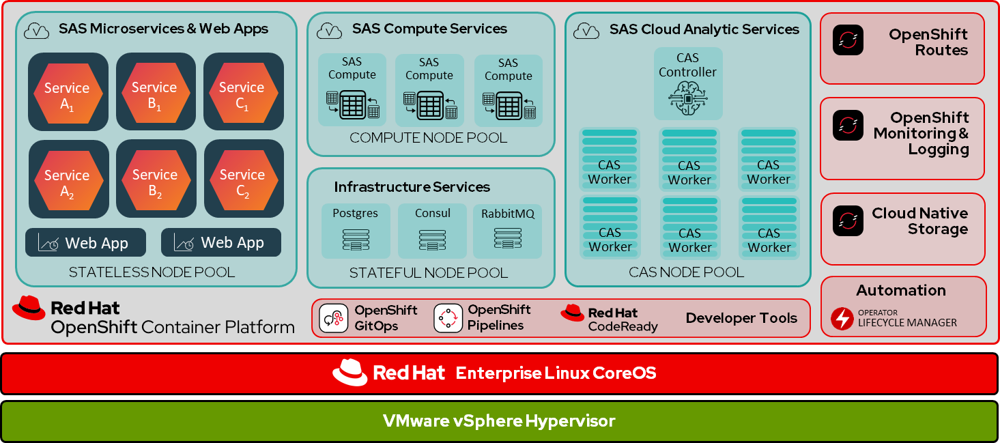
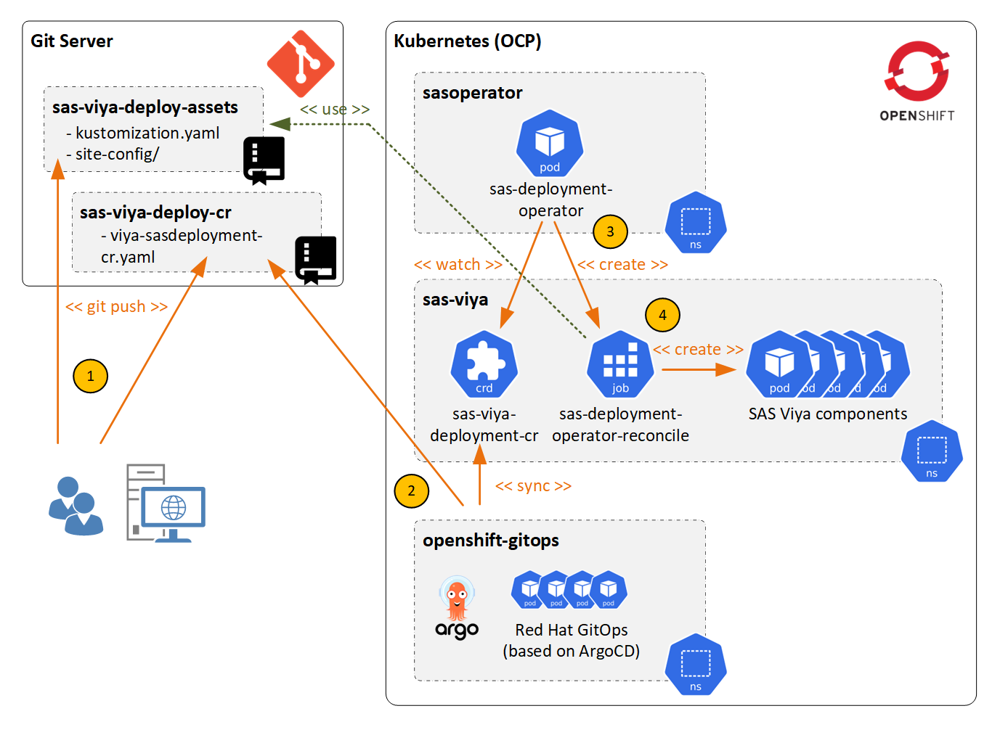
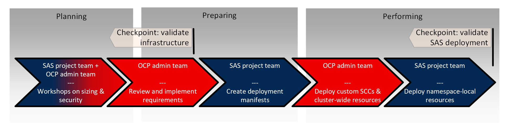

# SAS Viya on Red Hat OpenShift  – Part 1: Reference Architecture and Deployment Considerations
_May 19, 2023 | by Patrick Farley and Hans-Joachim Edert_

**_
This blog was written by Patrick Farley, Associate Principal Solutions Architect (Red Hat) 
_**
**_
and Hans-Joachim Edert, Advisory Business Solutions Manager (SAS Institute) 
_**

In this two-part blog, we will provide essential technical information about SAS Institute's latest analytic platform, [SAS Viya](https://www.sas.com/en_us/software/viya.html), as well as a reference architecture for deploying SAS Viya on Red Hat OpenShift Container Platform (OCP). Also, make sure to take a look at the second installment of this blog, where we will discuss security, machine management and storage considerations. Let’s start with a few introductory words before we get into the technical details.

Since the launch of SAS Viya in 2020, SAS has offered a fully containerized analytic platform based on a cloud-native architecture. Due to the scale of the platform, SAS Viya requires Kubernetes as an underlying runtime environment and takes full advantage of the native benefits of this technology. 

SAS supports numerous Kubernetes distributions, both in the public and private cloud. In fact, many SAS customers - partly due to specific use cases that do not allow otherwise from a regulatory perspective, but also due to strategic considerations - prefer to run their application infrastructure in a private cloud environment. 

In these cases, [Red Hat OpenShift](https://developers.redhat.com/products/openshift/overview) provides an optimal foundation for the SAS software stack. OpenShift offers both a hardened Kubernetes with many highly valued enterprise features as an execution platform, but also comes with an extensive ecosystem with a particular focus on supporting [DevSecOps capabilities](https://www.redhat.com/en/partners/devsecops).

SAS and Red Hat have enjoyed a productive partnership for more than a decade - while Red Hat Enterprise Linux was the preferred operating system in earlier SAS releases, today SAS has based their container images on the [Red Hat Universal Base Image](https://catalog.redhat.com/software/base-images).

Moreover, for Red Hat OpenShift deployments, SAS takes advantage of the OpenShift Ingress Operator, the cert-utils operator, OpenShift GitOps for deployment (optionally), and integrates into OpenShift’s security approach which is based on SCCs (Security Context Constraints) as part of their deployments.
  

## **SAS Viya on OpenShift Reference Architecture**
SAS Viya is an integrated platform that covers the entire AI and Analytics lifecycle. Thus, it is not just a single application, but a suite of integrated applications. One of the fundamental differences here is the nature of the workload that SAS Viya brings to the OpenShift platform. This affects the need for resources (CPU, memory, storage) and entails special security-specific requirements.

Moving SAS Viya to OpenShift gives Viya unprecedented scalability that was unavailable in previous SAS releases. SAS takes advantage of the scalability by breaking Viya down into different workload types and recommends assigning each workload to a class of nodes, i.e., to Machine Pools. This ensures that the proper resources are available to specific workloads. _Figure 1_ shows the separation of workloads to pools.

**_
Figure 1
_**

Note that the setup of pools is not mandatory and there might be reasons to ignore the recommendation if the existing cluster infrastructure is not suitable for such a split. Applying a workload placement strategy by using node pools provides a lot of benefits, as it allows you to tailor the cluster topology to workload requirements; you could, for example, choose different hardware configurations (nodes with additional storage, with GPU cards etc.). The placement of SAS workload classes can be enabled by applying predefined Kubernetes node labels and node taints.

Please refer to the second installment of this blog for an in-depth discussion around machine management on OpenShift, which explains how this can be simplified and automated by capabilities uniquely available in OpenShift.

It might be helpful for a better understanding to briefly explain the workload classes mentioned in this diagram.

### **SAS Cloud Analytic Server (CAS) (CAS NODE POOL)**
The core component at the heart of SAS Viya is the Cloud Analytics Server (CAS). It is an in-memory analytics engine. Data is loaded from the required data source into some in-memory tables then clients connect to CAS to run analytical routines against the data. The data loaded into memory for CAS can also be flushed to disk. This is why the CAS server usually has the highest resource requirements of all SAS Viya components: it is CPU- *and* memory-intensive and requires persistent storage accessible by all nodes hosting CAS pods.

CAS can be deployed in one of [two modes](https://go.documentation.sas.com/doc/en/sasadmincdc/v_039/casfun/n00001sascassrvmgt00000admin.htm):  _SMP_ (Symmetric Multi Processing) mode -- as a single instance server, and _MPP_ (Massive Parallel Processing) mode -- as a distributed server. In SMP mode, only one CAS pod is being deployed, in MPP mode, multiple CAS pods are used where one pod takes the role of a controller while the other pods are used for running the computations.

In a default configuration, i.e., when a CAS node pool is being used, each CAS pod runs on a separate worker node, claiming more than 90% of the available CPU and memory resources out-of-the-box. If there is no node pool available for CAS, transformer patches applied during the deployment limit the resource usage of CAS to the desired amount or allow co-existence of CAS with other workloads on the same node.

### **SAS Compute Services (COMPUTE NODE POOL)**
SAS Compute services represent the traditional SAS processing capabilities as used in all previous releases of SAS. A SAS session is launched either interactively by a user from a web application or in batch mode to run as a Kubernetes job to execute submitted SAS code to transform or analyze data. Due to this approach, SAS sessions are highly parallelizable. The number of sessions (or Kubernetes jobs) running in parallel is only limited by the available hardware resources.

The compute node pool is a good candidate for using the cluster autoscaler, if possible. Often customers have typical usage patterns that would directly benefit from this - for example, by intercepting usage peaks (scaling out for nightly batch workload, scaling in over the weekend, etc.). Please refer to the section on _Autoscaling_ in the second installment of this blog for more OpenShift specific details.

### **SAS Microservices and Web Applications (STATELESS NODE POOL)**
Most services in any SAS Viya deployment are designed as microservices, also known as [_12 factor apps_](https://12factor.net/). They are responsible for providing central services like auditing, authentication, etc. Also, grouped with these services are a set of stateless web applications which are the user interfaces which are exposed to end users, for example: _SAS Visual Analytics_, _SAS Model Manager_ and _SAS Data Explorer_.

### **Infrastructure Services (STATEFUL NODE POOL)**
The commodity services are basically the metadata management and storage services. They are made of several open-source technologies such as the internal SAS _Postgres database_, as well as _Consul_ and _RabbitMQ_ for messaging. This is where the critical operational data is stored. These services are rather I/O intensive and do require persistent storage.

  

## **Core Platform**
In the current iteration of SAS Viya on OpenShift, SAS only supports VMware vSphere 7.0 Update 1 or later as the deployment platform. The details of VMware configuration will not be covered in this blog with the assumption that VMware vSphere is well known in most environments. 

At the time of this document, BareMetal is on the roadmap as an alternative for on-premise deployments.  When deployed on a different infrastructure provider, such as Azure, AWS, Google or BareMetal, SAS Viya runs under the [_SAS Support for Alternative Kubernetes Distributions_](https://support.sas.com/en/technical-support/services-policies.html#k8s) policy.

At the time this blog was written, [Red Hat OpenShift versions 4.10 - 4.12 are supported for SAS Viya](https://documentation.sas.com/doc/en/itopscdc/v_039/itopssr/n098rczq46ffjfn1xbgfzahytnmx.htm#n0lrj1a1ia0fg9n1kxjlsedfg4dy). SAS works to align their SAS Viya Kubernetes support levels with Red Hat OpenShift and typically adds support for the latest OpenShift version updates within 1-2 months of a given OpenShift version release. Additional details about some of the specific OpenShift components that support the SAS Viya deployment are provided in _Part 2_ of this blog, so we only want to provide a high-level overview here:

- **OpenShift Ingress Operator**

   SAS has specific requirements for forwarding cookies during transaction execution. As such, they used special techniques using the HAProxy to make that happen. So, in this iteration only the OpenShift Ingress Operator is supported. 
   
- **OpenShift Routes** 

   SAS prefers the use of native features with the environments with their products, so they take advantage of OpenShift routes.
   
- **`cert-utils-operator`**

   SAS requires the use of this operator to manage certificates for TLS support and create keystores.
   
- **`cert-manager`**

   SAS Viya supports two different certificate generators, which are used for enforcing full-stack TLS. The default generator uses OpenSSL and is supplied out-of-the-box by SAS. Alternatively, you can optionally deploy and use `cert-manager` to generate the certificates used to encrypt the pod-to-pod communication. 
   
- **Security Context Constraints**

   Security Context Constraints (SCCs) provide permissions to pods and are required to allow them to run. SAS requires several custom SCCs to support SAS Viya Services with OpenShift. The SAS documentation provides information about the required SCCs to help understand their use in your environment and to address any security concerns.  Further details about the required custom SCCs are provided in _Part 2_ of this blog.
  

### **Deployment Options – Red Hat OpenShift**
There are various methods for [installing Red Hat OpenShift Container Platform on VMware vSphere,](https://docs.openshift.com/container-platform/4.12/installing/installing_vsphere/preparing-to-install-on-vsphere.html) including:

- _**Installer-provisioned infrastructure**_ (IPI) installation, which allows the installation program to pre-configure and automate the provisioning of the required resources.
- The [_**Assisted Installer**_,](https://docs.openshift.com/container-platform/4.12/installing/installing_on_prem_assisted/installing-on-prem-assisted.html) which provides a user-friendly installation solution offered directly from the [Red Hat Hybrid Cloud Console.](https://console.redhat.com/openshift/assisted-installer/clusters/~new)
- _**User-provisioned infrastructure**_ (UPI) installation, which provides a manual type of installation with the most control over the installation and configuration process.

An IPI installation results in an OCP cluster with the vSphere cloud provider configuration settings from the installation, which enables additional automation and dynamic provisioning after installation:

- [Persistent storage using the VMware CSI or in-tree driver operator](https://docs.openshift.com/container-platform/4.12/storage/container_storage_interface/persistent-storage-csi-vsphere.html).
- [Host Node management for Node pools using MachineSets](https://docs.openshift.com/container-platform/4.12/machine_management/index.html).
- [Autoscaling Nodes using the MachineAutoScaler and ClusterAutoScaler operators](https://docs.openshift.com/container-platform/4.12/machine_management/applying-autoscaling.html). 

Information about configuring these machine management and storage integration capabilities with OpenShift is supplied within _Part 2_ of this blog.

An [OpenShift installation on VMware vSphere](https://docs.openshift.com/container-platform/4.12/installing/installing_vsphere/preparing-to-install-on-vsphere.html) using the UPI or Assisted Installer methods can also be set up [post-installation with the vSphere cloud provider configuration](https://access.redhat.com/documentation/en-us/assisted_installer_for_openshift_container_platform/2022/html-single/assisted_installer_for_openshift_container_platform/index#vsphere-post-installation-configuration_installing-on-vsphere), to provide similar automation and dynamic provisioning capability as an IPI installation. This is out of the scope of this blog.
  

### **Deployment Options – SAS Viya**
There are several approaches for deploying SAS Viya on Red Hat OpenShift, which are described in the [_SAS Operations Guide_](https://documentation.sas.com/doc/en/itopscdc/v_039/itopscon/p0839p972nrx25n1dq264egtgrcq.htm):

- Manually by running `kubectl` commands
- Using the SAS Deployment Operator
- Using the `sas-orchestration` command line utility

#### ***1. Manual Deployment***
After purchasing a SAS Viya license, customers receive a set of deployment templates (known as the _deployment assets_ tarball) in YAML format which they need to modify to create the final deployment manifest (usually called `site.yaml`). SAS uses the [`kustomize`](https://kustomize.io/) tool for modifying the templates. Common customizations include the definition of a mirror repository, configuring TLS, high-availability, storage and other site-specific settings. The final deployment manifest can then be submitted to Kubernetes using multiple `kubectl` commands. 

_**NOTE**:  You must have cluster-admin privileges to manage deployments of SAS Viya._

Note that the final manifest contains objects which require elevated privileges for deployment, for example _Custom Resource Definitions_ (CRDs), `PodTemplates`, `ClusterRoleBindings`, etc., which means that in most cases the SAS project team will need support from the OpenShift administration team to carry out the deployment. SAS has tagged all resources that need to be deployed according to the required permissions. This enables task sharing between the project team (with namespace-admin permissions) and the administration team (with cluster-admin permissions). However, it is important to keep in mind that this dependency will come up again with later updates for example.

#### ***2. SAS Deployment Operator***
For that reason, using the [SAS Deployment Operator](https://go.documentation.sas.com/doc/en/sasadmincdc/v_039/dplyml0phy0dkr/n137b56hwogd7in1onzys95awxqe.htm) might provide a better solution. SAS provides an operator for deploying and updating SAS Viya. The SAS Deployment Operator is not (yet) a certified operator, so it will not be found in the OperatorHub or in the Red Hat Marketplace.

The SAS Viya Deployment Operator provides an automated method for deploying and updating the SAS Viya environments. It runs in the OpenShift cluster and watches for declarative representations of SAS Viya deployments in the form of _Custom Resources_ (CRs) of the type `SASDeployment`. When a new `SASDeployment` CR is created or an existing CR is updated, the Deployment Operator performs an initial deployment or updates an existing deployment to match the state that is described in the CR. A single instance of the operator can manage all SAS Viya deployments in the cluster.

_**NOTE**:  The Deployment Operator must have cluster-admin privileges to manage deployments of SAS Viya._

As part of a DevOps pipeline, the operator can largely automate deployments and deployment updates, reducing dependency on the OpenShift administration team. For example, the SAS Deployment Operator nicely integrates with OpenShift GitOps, which is a component of the Red Hat OpenShift Container Platform (OCP) that provide a turnkey CI/CD automation solution for continuous integration (CI) and continuous delivery (CD) tasks. OpenShift GitOps can be used to provide additional automation for a SAS Viya deployment by monitoring a Git repository for changes to the SAS CR manifest and automatically syncing its’ contents to the cluster. Pushing the CR manifest to the Git repository then triggers a sync with OpenShift GitOps. The CR will be deployed to Kubernetes, which in turn triggers the Operator and the deployment to start. _Figure 2_ illustrates this workflow:

**_
Figure 2
_**

For additional information, see the SAS blog [_Deploying SAS Viya using Red Hat OpenShift GitOps_](https://communities.sas.com/t5/SAS-Communities-Library/Deploying-SAS-Viya-using-Red-Hat-OpenShift-GitOps/ta-p/780616).

#### ***3. `sas-orchestration` Utility***
The `sas-orchestration` command-line utility offers the flexibility of both worlds: as a container image it can be launched manually on a Linux shell to create and submit the final deployment manifest (in other words:  it combines the `kustomize` and `kubectl` actions into one step) or it could be used as a step in a CI/CD pipeline, for example as a task in OpenShift Pipelines, Jenkins or GitHub Actions, etc.

_**NOTE**:  You must have cluster-admin privileges to perform a SAS Viya deployment using the `sas-orchestration` utility._

For more information about the `sas-orchestration` utility, see the SAS blog [_New SAS Viya Deployment Methods_](https://communities.sas.com/t5/SAS-Communities-Library/New-SAS-Viya-Deployment-Methods/ta-p/856206).

  
### SAS Viya Deployment From A Process Perspective
It has probably already become clear that deploying SAS Viya is a “team sport activity” due to the size and complexity of the software stack. Typically, project teams on OpenShift are granted namespace-local, but not cluster-wide permissions by the OCP admin team (_admin_ vs _cluster-admin_ role). We’ll provide more details on the security requirements later within _Part 2_ of this blog, but in short it means that the SAS project team will be lacking the necessary authorizations to carry out a deployment independently.

Based on our experiences with previous deployments at customer sites, we found the following process approach to be helpful. For the sake of this blog, we’re describing the process for a manual deployment:

**_
Figure 3
_**

The deployment process can be segmented into three phases (_planning_, _preparing_, and _performing_) with separate tasks for the two main actors, the SAS project team (e.g. local SAS administrators and system engineers from SAS Institute) and the OpenShift administration team.

- **Planning**: It’s usually a good idea to start with a joint workshop where the SAS team gives a technical overview about SAS Viya to the OCP administrators. This is where topics such as security, sizing, storage, networking etc. need to be discussed. 

- **Preparation**: The second task typically is in the hands of the OCP administrators: they need to review the requirements and prepare the project setup. The SAS team can then start preparing the deployment manifest (basically a YAML file) which contains site-specific information (such as the DNS name or the supplemental-groups value which is specific to the project/namespace).

- **Performing**: Once the deployment manifests are ready to be submitted, both teams need to collaborate to submit the manifests. While the OpenShift administrators can focus on resources which require elevated permissions (like custom _SCCs_ or _CRDs_), the SAS project team will handle all the resources with namespace scope. The main deployment manifest contains predefined selectors that allow to make this distinction between.

  
## **Conclusion**
With that we’d like to conclude this first part of our blog. We hope you found it helpful to provide you with the basic know-how you’ll need to support your project team in deploying SAS Viya on OpenShift… Stay tuned for the second installment where we will be discussing security and storage considerations.
  

