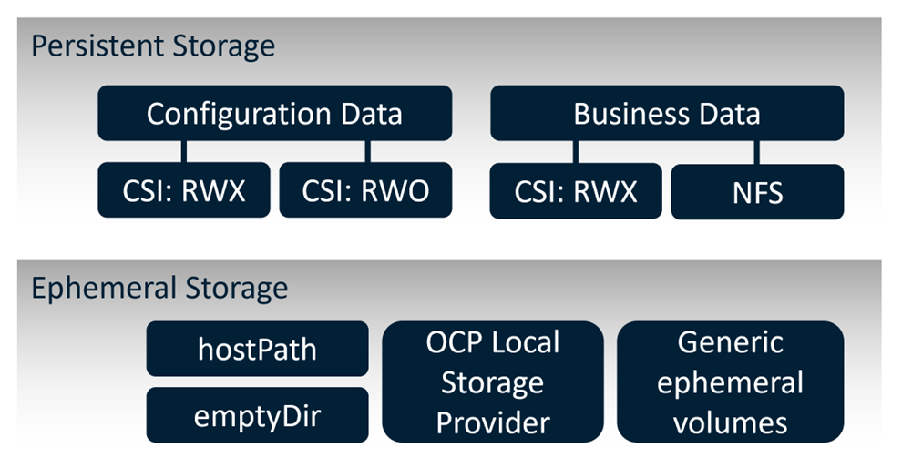
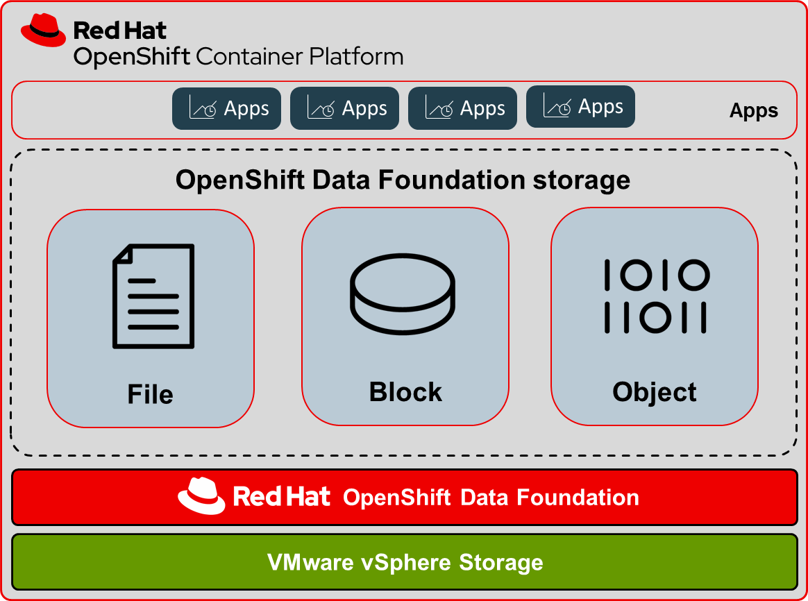

# SAS Viya on Red Hat OpenShift – Part 2: Security and Storage Considerations
_May 19, 2023 | by Patrick Farley and Hans-Joachim Edert_

**_<div align="center">This blog was written by Patrick Farley, Associate Principal Solutions Architect (Red Hat) </div>_**
**_<div align="center">and Hans-Joachim Edert, Advisory Business Solutions Manager (SAS Institute) </div>_**

Welcome back to this 2nd part of our blog where we want to share some basic technical information about SAS Viya on the Red Hat OpenShift platform. While we have been discussing the reference architecture and details on the deployment process in the first part of the blog, we now want to dive deeper into security and storage topics, which are at the core of any deployment.

## Security Considerations
As discussed in the first part of this blog, the SAS Viya analytical platform is not just a single application, but a suite of integrated applications. While most services are microservices following the 12-fasctor-app pattern, SAS also uses compute engines and stateful services which are essential for the platform. SAS integrates with the standard security approach that applies to OpenShift, namely the use of [Security Context Constraints (SCCs)](https://cloud.redhat.com/blog/managing-sccs-in-openshift).

Following Red Hat guidelines, most SAS Viya platform pods are deployed in the `restricted` SCC, which applies the highest level of security. However, there are a few exceptions: three other OpenShift predefined SCCs are used for some SAS services (`nonroot`, `anyuid`, and `hostmount-anyuid`). In addition, a few custom SCCs are either required by essential SAS Viya platform components, such as the CAS server, or associated with specific SAS offerings that might be included in your software order.

All custom SCCs which might be applied to the SAS deployment are shipped as part of the SAS deployment assets collection of files and templates, so there is no need to create them manually. As OpenShift administrators often want to review the content of these SCCs, the following command might be helpful to quickly see which custom SCCs are available and where they can be found:

   ```
   # change to the top-level folder of the deployment
   # directory and list all available SCCs
   cd $deploy
   find ./sas-bases -name "*scc*.yaml"
   ```

_**NOTE**:   You must have cluster-admin privileges to manage SCCs._

A SCC acts like a request for privileges from the OpenShift API. In an OpenShift environment, each Kubernetes pod starts up with an association with a specific SCC, which limits the privileges that the pod can request. 

An administrator configures each pod to run with a certain SCC by granting the corresponding service account for that pod access to the SCC. For example, if pod A requires its own SCC, an administrator must grant access to that SCC for the service account under which pod A is launched. 

Use the OpenShift CLI tool (`oc`) to apply the SCC, and to assign the SCC to a service account. Refer to the SCC example files provided in the `$deploy/sas-bases/examples` folder.

1.	Apply the SCC with the following command:

   ```
   oc apply -f example-scc.yaml
   ```

2.	Bind the SCC to the service account with the following command:

   ```
   oc -n <name-of-namespace> adm policy add-scc-to-user <scc name> -z <service account name>
   ```


For additional details about SCCs, please see the following:

- For a full list and description of the required SCCs, see [Security Context Constraints and Service Accounts](https://documentation.sas.com/doc/en/itopscdc/v_039/dplyml0phy0dkr/p1h8it1wdu2iaxn1bkd8anfcuxny.htm#p09z7ivwp61280n1jezh6i6qmoml) in *SAS Viya Platform: Deployment Guide*.
- For SCC types, see [SCCs and Pod Service Accounts](https://documentation.sas.com/doc/en/itopscdc/v_039/itopssr/n0bqwd5t5y2va7n1u9xb57lfa9wx.htm#p1qz3rq1f758xkn1pctnlw7c3kn6) in *System Requirements for the SAS Viya Platform*.
- For more information for each SCC, see the `README.md` file (for Markdown format) below the `$deploy/sas-bases/examples` folder or below `$deploy/sas-bases/docs` (for HTML format).
- For more information about applying SCCs with OpenShift, see the Red Hat blog titled “[Managing SCCs in OpenShift](https://cloud.redhat.com/blog/managing-sccs-in-openshift)”.

The following table gives an overview of all cases where a custom SCC (or an SCC other than restricted) is used: 

|**SAS SERVICE** | **SERVICE ACCOUNT NAME / SCC NAME** |**REQUIRED<br>or<br>OPTIONAL**|**WHEN NEEDED**|
| :- | :- | :-: | :- | 
| **CAS SERVER** | `sas-cas-server`\*|**REQUIRED**|CAS server needs to access cloud native storage|
| |`sas-cas-server-host`|**Optional**|CAS server runs in host launch configuration|
| |`sas-cas-server-sssd`|**Optional**|CAS server needs additional sssd configuration|
| **SAS COMPUTE** |<p>`sas-programming-environment` / `nonroot`**</p> |**REQUIRED**|SAS compute sessions must be launched with specific user/group IDs|
|  |<p>`sas-programming-environment` / `hostmount-anyuid`**</p> |**Optional**|SAS compute session needs to access hostPath mounts|
|  |<p>`sas-programming-environment` / `sas-watchdog`</p>|**Optional**|LOCKDOWN mode needs to be enforced|
| **SAS/CONNECT** |`sas-connect-spawner`|**Optional**|Only needed with legacy SAS clients|
| **MAS** |`sas-microanalytic-score`|**Optional**|If NFS volume mounts are needed|
| **SAS MODEL<br>MANAGEMENT** |`sas-model-publish-kaniko` / `anyuid`**|**Optional**|If analytical models are published into runtime container images|
|  |`sas-model-repository`|**Optional**|If NFS volume mounts are needed|
| **SAS EVENT<br>STREAM<br>PROCESSING** |`sas-esp-project` / `nonroot`**|**Optional**|If SAS Event Stream Processing is included in your deployment|
| **OPENSEARCH** |`sas-opendistro`|**Optional**|<p>For optimal performance, deploying OpenSearch software requires changes to a kernel setting</p>|

   \* Every deployment on OpenShift must apply one of the SCCs for the CAS server. By default, in a greenfield SAS Viya deployment for a new customer, we expect CAS to use cloud native storage and not need host launch capabilities.  So, at a minimum, the `cas-server-scc` SCC would be applied.

   ** These are standard SCCs defined by OpenShift. 

   *** The OpenSearch team [recommends](https://opensearch.org/docs/1.0/opensearch/install/important-settings/) to change the `vm.max_map_count` kernel parameter. The SAS deployment uses an init container to implement this change which requires elevated privileges. It it is possible to disable the mmap support completely, however this is discouraged since doing so will negatively impact performance and may result in out of memory exceptions. 

**OPENSEARCH SYSCTL MACHINECONFIG**

If privileged containers are not allowed in your environment, a `MachineConfig` can be used to set the `vm.max_map_count` kernel parameter for OpenSearch, as an alternative to using the `sas-opendistro` SCC with the init container. All nodes that run workloads in the [stateful workload class](https://documentation.sas.com/doc/en/itopscdc/v_039/dplyml0phy0dkr/p0om33z572ycnan1c1ecfwqntf24.htm) are affected by this requirement.

Perform the following steps; refer to "[_Adding kernel arguments to nodes_](https://docs.openshift.com/container-platform/4.12/nodes/nodes/nodes-nodes-managing.html#nodes-nodes-kernel-arguments_nodes-nodes-jobs)" in the OpenShift documentation.

1. List existing `MachineConfig` objects for your OpenShift Container Platform cluster to determine how to label your machine config:

   ```
   oc get machineconfig
   ```

2. Create a `MachineConfig` object file that identifies the kernel argument 
   (for example, `05-worker-kernelarg-vm.max_map_count.yaml`)

   ```
   apiVersion: machineconfiguration.openshift.io/v1
   kind: MachineConfig
   metadata:
     labels:
       machineconfiguration.openshift.io/role: worker
     name: 05-worker-kernelarg-vmmaxmapcount
   spec:
     kernelArguments:
       - vm.max_map_count=262144
   ```  

3. Create the new machine config:

   ```
   oc create -f 05-worker-kernelarg-vm.max_map_count.yaml
   ```

4. Check the machine configs to see that the new one was added:

   ```
   oc get machineconfig
   ```

5. Check the nodes:

   ```
   oc get nodes
   ```

   You can see that scheduling on each worker node is disabled as the change is being applied.

6. Check that the kernel argument was applied by going to one of the worker nodes and verifying with the `sysctl` command, or by listing the kernel command line arguments in the `/proc/cmdline` file on the host:

   ```
   oc debug node/vsphere-k685x-worker-4kdtl
   sysctl vm.max_map_count
   exit
   ```

   **Example output**

      ```
      Starting pod/vsphere-k685x-worker-4kdtl-debug ...
      To use host binaries, run 'chroot /host'
      
      sh-4.2\# sysctl vm.max_map_count
      vm.max_map_count=262144
      
      sh-4.2# exit
      ```

   If listing the `/proc/cmdline` file, you should see the `vm.max_map_count=262144` argument added to the other kernel arguments.

<br></br>

## **OpenShift Machine Management**
You can use machine management to flexibly work with underlying infrastructure of cloud platforms like vSphere to manage the OpenShift Container Platform cluster. You can control the cluster and perform auto-scaling, such as scaling up and down the cluster based on specific workload policies.

The OpenShift Container Platform cluster can horizontally scale up and down when the load increases or decreases. It is important to have a cluster that adapts to changing workloads.

Machine management is implemented as a CRD object that defines a new unique object Kind in the cluster and enables the Kubernetes API server to handle the object’s entire lifecycle. The Machine API Operator provisions the following resources: `Machine`, `MachineSet`, `ClusterAutoScaler`, `MachineAutoScaler`, and `MachineHealthCheck`.

_**NOTE**: You must have cluster-admin privileges to perform machine management._

As a cluster administrator, you can perform the following tasks with compute machine sets:

- [Create a compute machine set on vSphere](https://docs.openshift.com/container-platform/4.8/machine_management/creating_machinesets/creating-machineset-vsphere.html#creating-machineset-vsphere).
- [Manually scale a compute machine set](https://docs.openshift.com/container-platform/4.12/machine_management/manually-scaling-machineset.html#manually-scaling-machineset) by adding or removing a machine from the compute machine set
- [Modify a compute machine set](https://docs.openshift.com/container-platform/4.12/machine_management/modifying-machineset.html#modifying-machineset) through the `MachineSet` YAML configuration file.
- [Delete a machine](https://docs.openshift.com/container-platform/4.12/machine_management/deleting-machine.html#deleting-machine).
- [Create infrastructure compute machine sets](https://docs.openshift.com/container-platform/4.12/machine_management/creating-infrastructure-machinesets.html#creating-infrastructure-machinesets).
- Configure and deploy a [machine health check](https://docs.openshift.com/container-platform/4.12/machine_management/deploying-machine-health-checks.html#deploying-machine-health-checks) to automatically fix damaged machines in a machine pool

Red Hat OpenShift provides machine management as an automation method for managing the underlying cloud platform through a machine object, which is a subset of the node object.  This allows for the definition of compute machine sets that can be sized and matched to workload classes, and scaled to meet workload demand.
<br></br>

### 1. Workload Placement
Part 1 of this blog detailed the SAS Viya workload classes and node pools that can be used to place the workloads on appropriate nodes within the cluster. The [workload placement configuration, from the _SAS Viya Platform Operations_ manual](https://documentation.sas.com/doc/en/itopscdc/v_039/dplyml0phy0dkr/p0om33z572ycnan1c1ecfwqntf24.htm#n0wj0cyrn1pinen1wcadb0rx6vbm), provides the node labels and taints that can be included within the compute `MachineSet` definitions, so they are preconfigured at compute `Machine` creation time.

Refer to the `ClusterAutoScaler`, `MachineAutoScaler` and `MachineSet` definition examples provided in the section below titled “_Example Machine Management YAML Files_”.

#### ***MachineSet***
To deploy the machine set, you create an instance of the `MachineSet` resource.

Create a `MachineSet` definition YAML file for each SAS Viya workload class needed.  

1. Create a YAML file for the `MachineSet` resource that contains the customized resource definition for your selected SAS Viya workload class, using the examples available from the repo above.
   Ensure that you set the `<clusterID>` and `<role>` parameter values that apply to your environment.
   
2. If you are not sure which value to set for a specific field, you can check an existing machine set from your cluster:

   ```
   oc get machinesets -n openshift-machine-api
   ```

3. Check values of a specific machine set:

   ```
   oc get machineset <machineset_name> -n openshift-machine-api -o yaml
   ```

4. Create the new `MachineSet` CR:

   ```
   oc create -f cas-smp-machineset.yaml
   ```

5. View the list of machine sets:

   ```
   oc get machineset -n openshift-machine-api
   ```

When the new machine set is available, the DESIRED and CURRENT values match. If the machine set is not available, wait a few minutes and run the command again.

For more information about defining `MachineSets`, refer to "[_Creating a compute machine set on vSphere_](https://docs.openshift.com/container-platform/4.12/machine_management/creating_machinesets/creating-machineset-vsphere.html)" in the OpenShift documentation.


<br></br>

### 2. Autoscaling
Autoscale your cluster to ensure flexibility to changing workloads. To [autoscale](https://docs.openshift.com/container-platform/4.12/machine_management/applying-autoscaling.html#applying-autoscaling) your OpenShift Container Platform cluster, you must first deploy a cluster autoscaler, and then deploy a machine autoscaler for each <a name="_int_jvmpgk2v"></a>compute machine set. 

- The [*cluster autoscaler*](https://docs.openshift.com/container-platform/4.12/machine_management/applying-autoscaling.html#cluster-autoscaler-about_applying-autoscaling) increases and decreases the size of the cluster based on deployment needs. 
- The [*machine autoscaler*](https://docs.openshift.com/container-platform/4.12/machine_management/applying-autoscaling.html#machine-autoscaler-about_applying-autoscaling) adjusts the number of machines in the machine sets that you deploy in your OpenShift Container Platform cluster.


#### ***ClusterAutoScaler***
Applying autoscaling to an OpenShift Container Platform cluster involves deploying a cluster autoscaler and then deploying machine autoscalers for each machine type in your cluster.

To deploy the cluster autoscaler, you create an instance of the `ClusterAutoscaler` resource.

1. Create a YAML file for the `ClusterAutoscaler` resource that contains the customized resource definition (for example, `clusterautoscaler.yaml`).
2. Create the resource in the cluster:

   ```
   oc create -f clusterautoscaler.yaml
   ```

**IMPORTANT**: Ensure that the `maxNodesTotal` value in the `ClusterAutoscaler` resource definition that you create is large enough to account for the total possible number of machines in your cluster. This value must encompass the number of control plane machines and the possible number of compute machines that you might scale to across all machine sets.

For more information about defining the `ClusterAutoscaler` resource definition, refer to "[_Applying autoscaling to an OpenShift Container Platform cluster_](https://docs.openshift.com/container-platform/4.12/machine_management/applying-autoscaling.html)" in the OpenShift documentation.


#### ***MachineAutoScaler***
To deploy the machine autoscaler, you create an instance of the `MachineAutoscaler` resource.

1. Create a YAML file for the `MachineAutoscaler` resource that contains the customized resource definition (for example, `cas-mpp-autoscaler.yaml`).

2. Create the resource in the cluster:

  ```
  oc create -f cas-mpp-autoscaler.yaml
  ```

For more information about defining the `MachineAutoScaler` resource definition, refer to the [OpenShift documentation](https://docs.openshift.com/container-platform/4.12/machine_management/applying-autoscaling.html#machine-autoscaler-about_applying-autoscaling).


#### ***Example Machine Management YAML Files***
Example YAML files for the [`ClusterAutoScaler`](https://github.com/redhat-gpst/sas-viya-openshift/blob/main/clusterautoscaler.yaml), `MachineAutoScaler` and `MachineSet` definitions are available from the following repo: <https://github.com/redhat-gpst/sas-viya-openshift>

The following table provides the details about the example definition files provided for each of the SAS Viya [Workload Classes](https://documentation.sas.com/doc/en/itopscdc/v_039/dplyml0phy0dkr/p0om33z572ycnan1c1ecfwqntf24.htm#n0jo17lrlk83rsn1vvs2wqmewkt7), based on the [minimum sizing recommendations for OpenShift](https://documentation.sas.com/doc/en/itopscdc/v_039/itopssr/n08i2gqb3vflqxn0zcydkgcood20.htm#p04uz29tbignsin10sk5ld8h6jn0).

|**Workload Class**|**Example MachineSet file**|**Example MachineAutoScaler file**|
| :- | :- | :- |
|<p>CAS workloads (SMP)</p><p>CAS workloads (MPP)</p>|<p>[`cas-smp-machineset.yaml`](https://github.com/redhat-gpst/sas-viya-openshift/blob/main/cas-smp-machineset.yaml)</p><p>[`cas-mpp-machineset.yaml`](https://github.com/redhat-gpst/sas-viya-openshift/blob/main/cas-mpp-machineset.yaml)</p>|<p>[`cas-smp-autoscaler.yaml`](https://github.com/redhat-gpst/sas-viya-openshift/blob/main/cas-spp-autoscaler.yaml)</p><p>[`cas-mpp-autoscaler.yaml`](https://github.com/redhat-gpst/sas-viya-openshift/blob/main/cas-mpp-autoscaler.yaml)</p>|
|Connect workloads|[`connect-machineset.yaml`](https://github.com/redhat-gpst/sas-viya-openshift/blob/main/connect-machineset.yaml)|[`connect-autoscaler.yaml`](https://github.com/redhat-gpst/sas-viya-openshift/blob/main/connect-autoscaler.yaml)|
|Compute workloads|[`compute-machineset.yaml`](https://github.com/redhat-gpst/sas-viya-openshift/blob/main/compute-machineset.yaml)|[`compute-autoscaler.yaml`](https://github.com/redhat-gpst/sas-viya-openshift/blob/main/compute-autoscaler.yaml)|
|Stateful workloads|[`stateful-machineset.yaml`](https://github.com/redhat-gpst/sas-viya-openshift/blob/main/stateful-machineset.yaml)|[`stateful-autoscaler.yaml`](https://github.com/redhat-gpst/sas-viya-openshift/blob/main/stateful-autoscaler.yaml)|
|Stateless workloads|[`stateless-machineset.yaml`](https://github.com/redhat-gpst/sas-viya-openshift/blob/main/stateless-machineset.yaml)|[`stateless-autoscaler.yaml`](https://github.com/redhat-gpst/sas-viya-openshift/blob/main/stateless-autoscaler.yaml)|


<br></br>
### **SAS Viya Storage Requirements**
Before we close off this blog series, we would like to spend a few words on the storage requirements of SAS Viya. If you’ve made it so far, you might already expect that a software stack like SAS Viya, which focuses on Data Management and Analytics, comes with the need for persistent (and ephemeral) storage. 

This is one of the most important topics to be discussed when preparing the deployment on OpenShift, as choosing a suitable storage configuration usually makes a key difference for the user experience. SAS compute sessions have always been heavily dependent on good disk I/O performance and this requirement has not changed with the latest SAS platform. 

Many SAS Viya components require highly performant storage, and SAS generally recommends a sequential I/O bandwidth of 90-120 MB per second, per physical CPU core. Normally this would be achieved by utilizing a storage system that is backed by using SSD or NVMe disks.  SAS provides an automated utility script -- [rhel_iotest.sh](https://documentation.sas.com/doc/en/itopscdc/v_039/itopssr/n0bqwd5t5y2va7n1u9xb57lfa9wx.htm#p1qz3rq1f758xkn1pctnlw7c3kn6), that uses UNIX/Linux dd commands to measure the I/O throughput of a file system in a Red Hat Enterprise Linux (RHEL) environment.  This script can be used to compare the measured throughput of the storage in your environment to the recommendation.

Since this is a rather complex topic with lots of facets, here's a picture which hopefully helps you to keep your orientation for the rest of this section: 

<p align="center"></p>

**_<div align="center">Figure 1</div>_**

_Figure 1_ summarizes the key storage requirements for SAS Viya, using _persistent storage_ and _ephemeral storage_. 

_**Persistent storage**_, is required for two purposes with SAS Viya:
   - **Stateful services configuration data** (_Consul_, _Redis_, etc.). This storage requirement is mandatory for the deployment; made available through the Kubernetes CSI API for [persistent volumes in both RWO and RWX access modes](https://documentation.sas.com/doc/en/itopscdc/v_039/itopssr/n0ampbltwqgkjkn1j3qogztsbbu0.htm#n0mmuxy47s2nnrn1l5rfb5fxtb4d). 
   
   - **File-based business data**. Optional, but it’s a very common situation that existing file shares with business data (SAS datasets, CSV files, Excel etc.) have to be made available to the SAS compute pods. These collections of files are either accessed through the CSI API (in RWX mode) or could also be mounted directly to the pods using a direct NFS configuration, etc. It’s important to state that poor disk I/O performance can turn into a real bottleneck for users of the Viya platform.

[Dynamic volume provisioning is provided by the in-tree and CSI vSphere storage provider for OpenShift on VMware vSphere](https://docs.openshift.com/container-platform/4.12/storage/persistent_storage/persistent-storage-vsphere.html#dynamically-provisioning-vmware-vsphere-volumes). OpenShift Data Foundation (ODF) provides added flexibility as it can also provide file, block and object storage with both RWO and RWX access modes.
<p></p>

_**Ephemeral storage**_ is a major requirement for the SAS compute engine and the CAS server. Both engines heavily rely on fast storage for storing intermediate data which is no longer needed after the session has ended. Like what was said above, I/O performance is crucial for this storage to prevent it from turning into a bottleneck for users.

There are a few technical options available to provide this ephemeral storage, using **Local storage** on the worker node:
-  **`hostPath` configuration**. While it would be easy to configure, this is often rejected for security reasons.

- [**OpenShift Local Storage Operator**](https://docs.openshift.com/container-platform/4.12/storage/persistent_storage/persistent_storage_local/persistent-storage-local.html). 
      If you’re interested in learning more about this option, make sure to check out this SAS blog titled "[SAS Viya Temporary Storage on Red Hat OpenShift – Part 1](https://communities.sas.com/t5/SAS-Communities-Library/SAS-Viya-Temporary-Storage-on-Red-Hat-OpenShift-Part-1/ta-p/858834)".

- **`emptyDir`**. This seems to be a tempting option at first, and it certainly can be used for test environments, but it is strictly not recommended for production or near-production clusters.

- **Generic ephemeral volumes**. This is a new configuration option introduced with [OpenShift 4.11](https://docs.openshift.com/container-platform/4.11/storage/generic-ephemeral-vols.html) / [Kubernetes 1.23](https://kubernetes.io/docs/concepts/storage/ephemeral-volumes/#generic-ephemeral-volumes-1). This configuration uses the **`volumeClaimTemplate`** keyword in pod manifests to create per-pod volumes “on-the-spot". 

There are a couple of SAS blogs available that describe how to configure ephemeral general volumes for the SAS compute engine and the CAS server:
   - [SAS Viya Temporary Storage on Red Hat OpenShift – Part 2: CAS DISK CACHE](https://communities.sas.com/t5/SAS-Communities-Library/SAS-Viya-Temporary-Storage-on-Red-Hat-OpenShift-Part-2-CAS-DISK/ta-p/859250)
   - [Using generic ephemeral volumes for SASWORK storage](https://communities.sas.com/t5/SAS-Communities-Library/Using-generic-ephemeral-volumes-for-SASWORK-storage-on-Azure/ta-p/839257)

<br></br>
#### ***Cloud Native Storage Integration***
**OpenShift on VMware vSphere** supports [dynamic provisioning](https://docs.openshift.com/container-platform/4.12/storage/persistent_storage/persistent-storage-vsphere.html#dynamically-provisioning-vmware-vsphere-volumes) and [static provisioning](https://docs.openshift.com/container-platform/4.12/storage/persistent_storage/persistent-storage-vsphere.html#vsphere-static-provisioning_persistent-storage-efs) of VMware vSphere volumes with the in-tree and the [Container Storage Interface (CSI) vSphere storage provider](https://docs.openshift.com/container-platform/4.12/storage/container_storage_interface/persistent-storage-csi-vsphere.html).  

If the underlying [vSphere environment supports the vSAN file service](https://docs.openshift.com/container-platform/4.12/storage/container_storage_interface/persistent-storage-csi-vsphere.html#persistent-storage-csi-vsphere-rwx_persistent-storage-csi-vsphere), then the vSphere CSI Driver Operator installed by OpenShift supports provisioning of _ReadWriteMany_ (RWX) volumes. If vSAN file service is not configured, then _ReadWriteOnce_ (RWO) is the only access mode available. 

[**Red Hat OpenShift Data Foundation (ODF)**](https://www.redhat.com/en/technologies/cloud-computing/openshift-data-foundation) is a persistent software-defined, container-native storage solution that’s integrated with and optimized for Red Hat OpenShift Container Platform. ODF is now included as part of [_OpenShift Platform Plus_](https://www.redhat.com/en/technologies/cloud-computing/openshift/platform-plus). In addition to Red Hat OpenShift Container Platform, _OpenShift Platform Plus_ also includes Red Hat OpenShift Advanced Cluster Management for Kubernetes, Red Hat OpenShift Advanced Cluster Security for Kubernetes, Red Hat Quay container registry platform, and OpenShift Data Foundation for persistent data services. 

Deployed, consumed, and managed through the Red Hat OpenShift administrator console, the ODF platform is built on _Ceph_ petabyte-scale persistent cloud storage, the _Rook_ Kubernetes storage operator, and _NooBaa_ multicloud object gateway technology supporting file, block, and object storage. ODF runs anywhere that Red Hat OpenShift does -- on-premises or in hybrid cloud environments. Dynamic, stateful, and highly available container-native storage can be provisioned and deprovisioned on demand with OpenShift Data Foundation.

Deploying ODF with OpenShift on VMware VMs can use [dynamic storage devices from the VMware vSphere storage provider](https://access.redhat.com/documentation/en-us/red_hat_openshift_data_foundation/4.12/html-single/deploying_openshift_data_foundation_on_vmware_vsphere/index#deploy-using-dynamic-storage-devices-vmware), and provides you with the option to create the internal cluster storage resources during deployment. This results in the internal provisioning of the base services, and the additional storage classes available to applications. 
ODF provides _ReadWriteOnce_ RWO (file, block) and _ReadWriteMany_ RWX (shared file, shared block) volume modes.

<p align="center"></p>

**_<div align="center">Figure 2</div>_**


The following table summarizes two of the [persistent storage solutions that may be used with OpenShift](https://docs.openshift.com/container-platform/4.12/storage/understanding-persistent-storage.html#pv-access-modes_understanding-persistent-storage) when deployed on VMware vSphere, including their supported volume access modes.

|**Volume Plugins**|**ReadWriteOnce**|**ReadWriteMany**|
| :- | :-: | :-: |
| VMware vSphere | ✅ | ✅ \* |
| Red Hat OpenShift Data Foundation | ✅ | ✅ |

   \* If the underlying vSphere environment supports the vSAN file service, then the vSphere Container Storage Interface (CSI) Driver Operator installed by OpenShift Container Platform supports provisioning of _ReadWriteMany_ (RWX) volumes. If you do not have vSAN file service configured, and you request RWX, the volume fails to get created and an error is logged. For more information, see "[VMware vSphere CSI Driver Operator](https://docs.openshift.com/container-platform/4.12/storage/container_storage_interface/persistent-storage-csi-vsphere.html)" in the OpenShift documentation.


<br></br>
## **Conclusion**
With this we’re coming to the end of our blog series about deploying SAS Viya on the Red Hat OpenShift container platform. In the first installment of the blog, we started with giving an overview, described a reference architecture and discussed the deployment process, while in this part of the blog we focused on security considerations, cluster topology automation and storage requirements.

We hope that you enjoyed reading the blogs and would like to invite you to get in touch with us if you have any questions or feedback.


